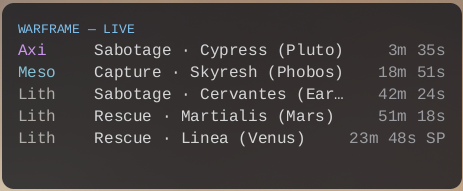
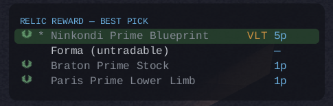

# warframe-lite

[](https://github.com/albrektsson/warframe-lite/actions/workflows/ci.yml)
[](https://github.com/albrektsson/warframe-lite/actions/workflows/github-code-scanning/codeql)
[](https://github.com/albrektsson/warframe-lite/actions/workflows/dependabot/dependabot-updates)

> **Disclaimer:** built with AI assistance. Run it at your own risk — it
> only reads `EE.log` and only reads game memory, never writes to either.
> See [docs/research/memory-reading-ban-risk-and-prior-art.md](docs/research/memory-reading-ban-risk-and-prior-art.md)
> for the detail. 
>
> **Network:** contacts `api.warframe.market`,
> `api.warframestat.us`, `raw.githubusercontent.com`, and
> `api.warframe.com`/`mobile.warframe.com` — nothing else.

A standalone, **Linux-native** companion for [Warframe](https://www.warframe.com/) —
a light alternative to [AlecaFrame](https://alecaframe.com/) that runs **without
Overwolf**. Built for KDE Plasma (Wayland) with the game under Steam Proton, in Rust.

It shows a click-through overlay on top of the game with:

- **Live Void Fissures** — sorted normal → Steel Path → Storm, with ETAs that
  tick down each second, filterable by relic tier, mission type, and kind
  (Steel Path/Void Storm) so the panel only shows what you're farming for.
- **An automatic relic reward picker** — when a Void Fissure reward screen
  appears, the overlay shows the 2–4 rewards ranked by live warframe.market
  plat price, with the best pick highlighted and a mastery emblem in front of
  primes you have already **mastered**. No keypress needed.
- **An owned-relic mastery guide** — open the in-game **Void Relics** screen and
  the overlay automatically scans your relics as you scroll, then shows which of
  the ones you own can still drop a prime you **haven't mastered**, ranked by
  relic price.
- **A mastery planner** — flips the view around: for every prime you haven't
  mastered, which of your owned relics (and how many) can still drop it, so you
  know which fissure tier is worth farming next. The scanned owned-relic set is
  saved to disk, so this works any time — no need to have the Relics screen open.

<p align="center">
  
  
</p>

## Install & run

warframe-lite is a single self-contained binary (`wf-lite`) — clone and build
from source (no prebuilt releases pre-1.0). The relic OCR reward picker is
part of the default build, so building needs `tesseract-devel`/
`leptonica-devel`/`clang`; see [docs/ocr.md](docs/ocr.md) for per-distro
package names.

```
git clone https://github.com/albrektsson/warframe-lite.git
cd warframe-lite
cargo build --release
install -Dm755 target/release/wf-lite ~/.local/bin/wf-lite
```

Run it:

```
wf-lite
```

It sits in the tray, waits for Warframe to start, and auto-starts the
overlay when the game window appears (stopping it when the game closes).

For running without the tray, a desktop launcher, mastery badges, mem-scan,
hotkey binding, and full configuration options, see
[docs/advanced-setup.md](docs/advanced-setup.md).

## Commands

Every subcommand below runs inside this same `wf-lite` binary and process
(or a self-re-exec of it, for the overlay/mem-scan's crash isolation) —
there's nothing separate to install or keep alongside it:

```
wf-lite                    # (no command) show this list of commands
wf-lite status             # live Void Fissures
wf-lite <market_slug>      # price an item, e.g. `wf-lite mirage_prime_set`
wf-lite relics <codes…>    # owned-relic guide: unmastered rewards + prices
wf-lite mastery-plan       # unmastered primes + which owned relics drop them
wf-lite tray               # tray companion: waits for the game, runs the overlay
wf-lite overlay            # show the live overlay (live fissures + relic picker)
wf-lite browse             # open the mastery/relic browser (Home/Mastery/Relics/Sell/Settings)
wf-lite settings           # alias for `browse` — Settings is a tab there, not its own window
wf-lite toggle             # show/hide a running overlay (also: show / hide)
wf-lite copy               # copy the current best-pick reward (name + plat) to the clipboard
wf-lite capture [out.png]  # capture the Warframe window to a PNG
wf-lite relic [names…]     # evaluate reward names → matched item + plat
wf-lite relic-scan         # capture the reward screen, OCR the names, rank them — see docs/ocr.md
wf-lite detect-account     # auto-detect your account id from EE.log (verified)
wf-lite set-account <id>   # save your account id for mastery lookup
wf-lite mastery [id]       # report your mastered-item count
wf-lite logstats           # parse whole EE.log history, report coverage/events
wf-lite logwatch           # follow EE.log live, print recognized events
wf-lite mem-scan           # read live Foundry/relic/equipment state — see docs/mem-scan.md
```

## When we scan game memory

Memory is only ever read when you explicitly trigger it — never in the
background, never on a timer, never as part of the overlay's normal
operation. The three equivalent entry points are `wf-lite mem-scan` on the
command line, the **Scan Memory** button on `wf-lite browse`'s Home tab, and
the matching item in `wf-tray`'s right-click menu. Each click or invocation
*is* the consent; there's no separate confirmation prompt. See
[docs/mem-scan.md](docs/mem-scan.md) for what gets read and why.

If you never run a memory scan, owned-relic and owned-Prime-Part tracking
still works — it falls back to OCR, reading the screen pixels instead. That
only picks up what you actually show it, though: open the in-game **Void
Relics** screen (or **Inventory → Sell**) and scroll through it while the
overlay is running, and it scans each grid page as it passes. Memory scans
are exact; OCR scans are a frame-agreement estimate, and the app tracks
which source last wrote each count.

## Build

```
cargo build --release
cargo test
```

Only `wf-lite` needs installing — this also happens to build a few other
crates' own standalone `[[bin]]` targets (`wf-tray`, `wf-browse`,
`wf-settings`) into `target/release/`, but those are dev/embedding-only, not
part of the distributed product; see [docs/development.md](docs/development.md).
See [docs/ocr.md](docs/ocr.md) and [docs/mem-scan.md](docs/mem-scan.md) for
the OCR/mem-scan feature details and build requirements.

## License

MIT — see [`LICENSE`](LICENSE).

The bundled *Warframe* UI assets — the mastery laurel
(`crates/wf-overlay/assets/mastered.png`, shown on mastered rewards) and the
"unowned" eye icon (`assets/relic-unowned-eye.png`, used only to detect which
relics you don't own) — remain the property of **Digital Extremes Ltd.** They are
included solely to identify game state in this fan companion; *Warframe* is a
trademark of Digital Extremes. This project is unofficial and not affiliated with
or endorsed by Digital Extremes.

## Design & roadmap

See [`docs/PLAN.md`](docs/PLAN.md) for the feasibility analysis, architecture, and
implementation status; [`CONTEXT.md`](CONTEXT.md) for the project vision and
domain vocabulary; and [`AGENT.md`](AGENT.md) for contributing conventions.
